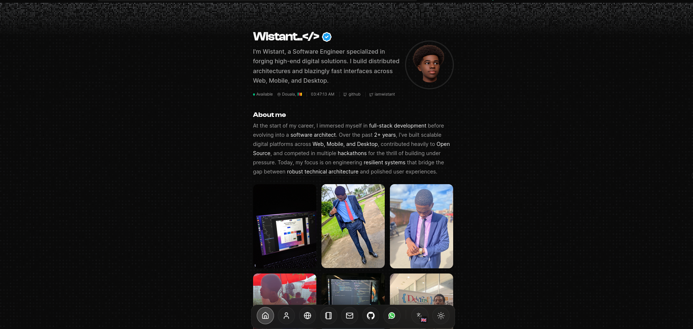
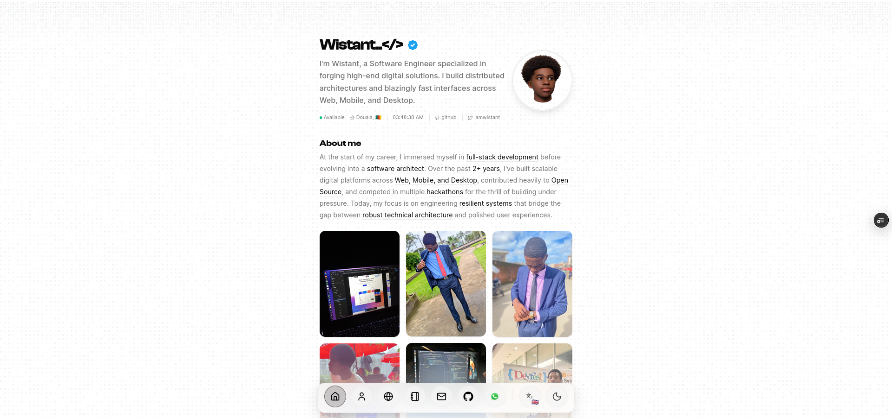
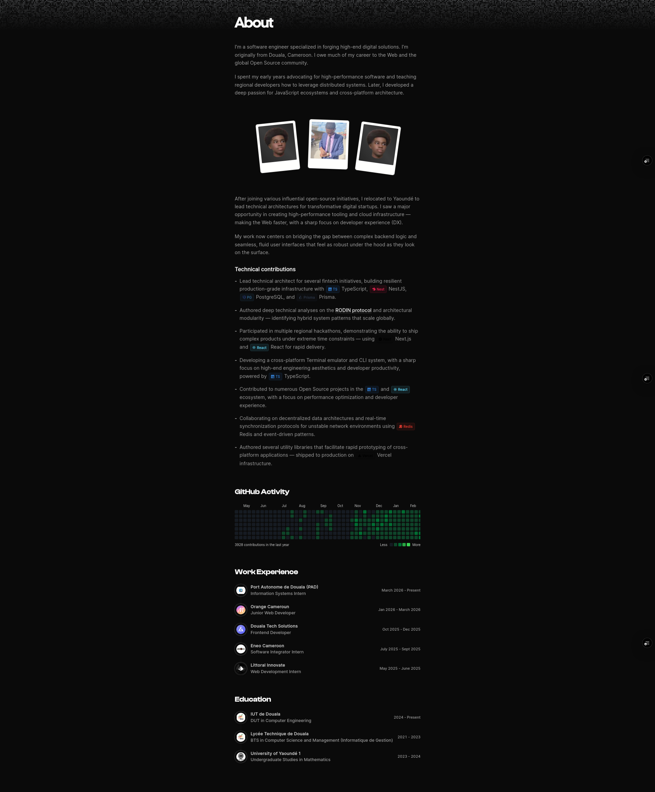
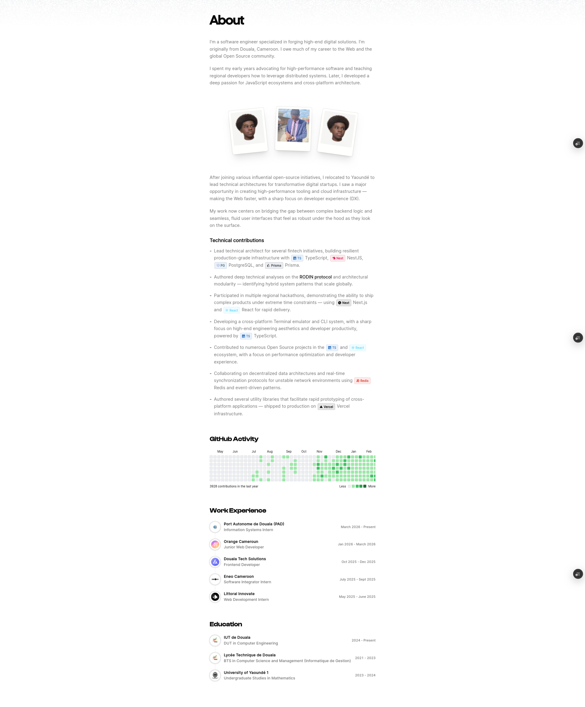

<div align="center">
  
  <h1>Wistant</h1>
  <p><b>Personal Hub • Portfolio • MDX Blog</b></p>
  <p>The intersection of engineering precision and digital storytelling.</p>
</div>

<p align="center">
  <a href="https://github.com/wistantkode"></a><a href="https://x.com/wistant"></a><a href="https://linkedin.com/in/wistantkode"></a>
</p>

<p align="center">
  <a href="https://www.wistant.me">Website</a> •
  <a href="src/app/README.md">Architecture</a> •
  <a href="src/content/README.md">Content</a> •
  <a href="https://github.com/wistantkode">Source</a>
</p>

---

### Showcase

<p align="center">
  
  
</p>

<p align="center">
  
  
</p>

---

### Technical Specification

Wistant is a sophisticated, full-stack personal engine architected for high-performance content delivery and professional branding. It moves beyond a simple static site, implementing a robust suite of server-side and client-side features.

- **Advanced i18n Engine** — Built-in support for `EN`, `FR`, `ES`, `AR`, and `WO` through a custom middleware and strictly typed dictionary system.
- **Dynamic MDX Pipeline** — High-speed content processing via `content-collections`, featuring Shiki syntax highlighting and automated reading-time calculation.
- **Serverless Analytics** — Integrated with Upstash Redis for real-time engagement metrics, tracking view counts across the global edge.
- **Automated Meta-Generation** — Dynamic OpenGraph and Twitter card generation via Next.js Route Handlers for every page and post.

### Project Blueprint

| Module | Core Responsibility |
| :--- | :--- |
| **`app/`** | Next.js 16 App Router hierarchy, i18n middleware, and localized metadata. |
| **`components/`** | Reusable UI primitives, Framer Motion animations, and custom MVP blocks. |
| **`content/`** | The source of truth for the MDX-powered blog and technical portfolio. |
| **`lib/`** | Atomic utility functions, Redis client orchestration, and i18n helpers. |

### Development Workflow

```bash
# Environment Setup
git clone https://github.com/wistantkode/www.wistant.me.git
pnpm install
cp .env.example .env.local

# Local Execution
pnpm dev # Spawns the development server with Turbopack
```

---

<div align="center">
  
  <p><b>Wistant</b><br />Personal Hub • Portfolio • MDX Blog</p>
  <i>Designed and engineered with absolute precision.</i>
</div>
